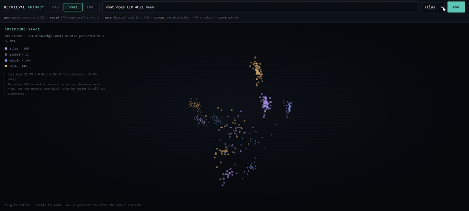
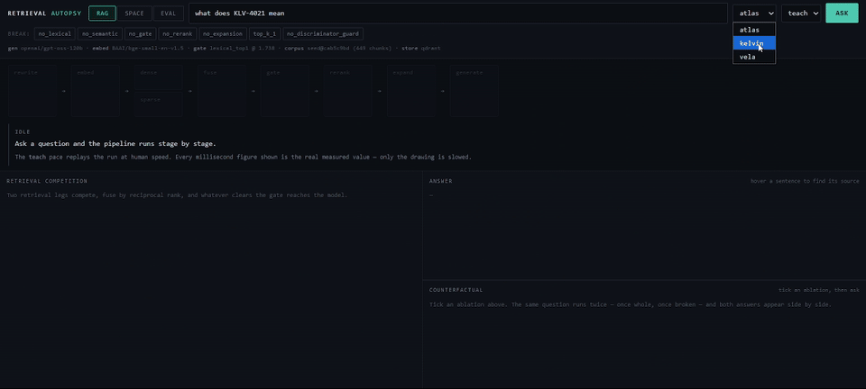
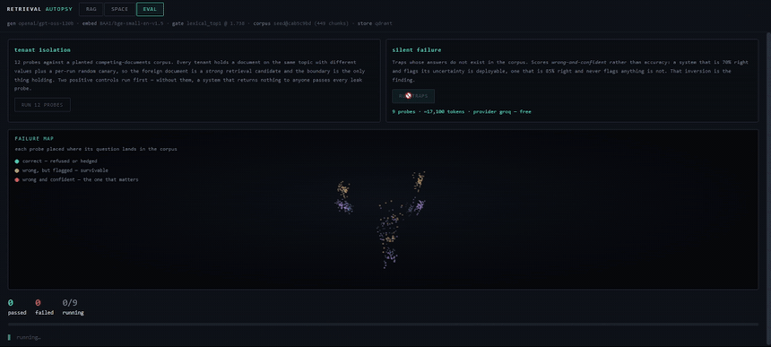

<h1 align="center">Retrieval Autopsy</h1>

<p align="center">
  <b>A RAG pipeline built to be <i>observed</i>.</b><br>
  Every stage is instrumented and every stage is switchable, so one system powers a live
  visual debugger, a headless eval suite, and an ablation study.
</p>

<p align="center">
  <a href="#installation"></a>
  <a href="LICENSE"></a>
  <a href="#installation"></a>
  <a href="#tests"></a>
  <a href="docs/FINDINGS.md"></a>
</p>

<p align="center">
  Built by <b>Kushal Desai</b>
</p>

<p align="center">
  
</p>

<p align="center">
  <sub>
    449 chunks in a 3D projection of the 384-dimensional embedding space. The question
    lands, <b>both retrieval legs fire at once</b> — solid violet for semantic, dashed red
    for lexical — the chunks that survive the gate travel to the model, and the answer
    returns with its citation. Three axes hold 36.8% of the variance, and the view says so
    on screen: it is a reading aid, not the metric.
  </sub>
</p>

---

## What it does

Most RAG systems are a black box with a text box on the front. When the answer is wrong you
cannot tell whether retrieval missed, fusion mis-ranked, the gate should have refused, or
the model ignored what it was given.

This one records all of it. A single `Trace` object carries every stage's timing, both
retrieval legs with their ranks **and** raw scores, why each candidate was rejected, what
the gate decided and on what threshold, and sentence-level attribution for the answer. The
inspector, the eval runner and the ablation study are three views of that same object.

- **Hybrid retrieval** — BM25 + dense vectors, reciprocal rank fusion, per-tenant indexes
  so filtering happens *before* scoring rather than after
- **Ablations as configuration** — every stage is `Optional`; `None` means ablated, so
  "what breaks without the reranker" is a config transform, not a code branch
- **A refusal gate** calibrated from the corpus rather than inherited from a blog post
- **Eval suites that fail the build** — tenant isolation, and ten traps whose answers do
  not exist, scored on how often the system is wrong *and confident*
- **Runs with no API key** — a deterministic offline simulator, or real models on a free tier

## Installation

**Requires Python 3.12+.** No API key, no Docker, no Node.

```bash
git clone https://github.com/kush1311/Retrieval-Autopsy.git
cd Retrieval-Autopsy

python -m venv .venv
source .venv/bin/activate          # Windows: .venv\Scripts\Activate.ps1

pip install -r requirements.txt
export PYTHONPATH=.                # Windows: $env:PYTHONPATH = "."

python -m autopsy.cli ingest       # generate the corpus and build the index
```

```
  generated 54 documents and 540 test cases
  449 chunks (449 embedded, 0 reused)
  corpus version: seed@cab5c9bd
```

Nothing is downloaded — the corpus is *generated* from a fixed seed, which is why your
numbers should match those exactly. Run `ingest` twice and the second reports
`0 embedded, 449 reused`: chunk IDs are content-addressed, so re-ingesting is a no-op.

`pip install -e ".[all]"` is equivalent if you prefer `pyproject.toml`. Add
`pip install -r requirements-dev.txt` to run the tests.

## Usage

### Ask one question

```bash
python -m autopsy.cli query "what does KLV-4021 mean" --tenant tenant_kelvin
```

Prints the whole trace, not just an answer: stages with timings, both retrieval legs with
ranks and scores, what the gate decided, the answer and its citation.

### Break it on purpose

Any stage can be removed for a single query. `--ablation` is repeatable, so guards can be
removed in combination:

```bash
python -m autopsy.cli query "…" --tenant tenant_kelvin --ablation no_lexical
python -m autopsy.cli query "…" --tenant tenant_kelvin \
       --ablation no_lexical --ablation no_discriminator_guard
```

Fourteen are defined — `no_gate`, `no_rerank`, `no_semantic`, `top_k_1` and the rest — listed
by `GET /api/meta`. The interesting ones are the *composites*: removing two redundant guards
at once produces failures neither removal produces alone.

Whether a given query actually breaks depends on the embedder. Under the free `fastembed`
default, `KLV-4021` is retrieved at rank 1 by **both** legs, so dropping the lexical leg
changes nothing for it. The aggregate cost is real but small — 3 to 19 percentage points of
gold-chunk retention depending on context width, measured in
[docs/FINDINGS.md](docs/FINDINGS.md#the-finding).

```bash
python -m autopsy.cli ablate --core -n 25     # the study, not one anecdote
```

### Open the inspector

```bash
python -m uvicorn api.main:app --port 8000     # http://localhost:8000
```

Three tabs — **RAG** (the nine stages executing), **SPACE** (the 3D view above), and
**EVAL** (trap suites running live, each probe plotted where its question lands). The pace
control buffers and replays events, so displayed milliseconds stay the real measured values.

<details>
<summary><b>Watch the RAG and EVAL tabs run</b> — two recordings</summary>

<br>

**RAG** — one question, the whole pipeline. Stages light up as they execute, both retrieval
legs compete side by side with ranks *and* raw scores, losing candidates are struck through
as they are rejected, and the answer arrives with its grounding badges.



Read the header when it settles: `1 model call · 7ms end to end · $0.000000`. Retrieval is
most of that. **The expensive stage can only ever be as good as what retrieval handed it** —
which is the argument for instrumenting retrieval rather than tuning the prompt.

<br>

**EVAL** — ten traps whose answers do not exist in the corpus, each probe plotted where its
question lands. Green means the system was honest, amber means wrong but flagged, red means
wrong *and confident*. Red is the only colour that matters: a wrong answer that flags itself
is survivable, and one that doesn't is the failure this project exists to measure.



</details>

### Run the suites

```bash
python -m pytest tests -q          # 230 tests, no key needed
python -m autopsy.cli eval         # isolation + silent-failure, exits non-zero on regression
```

`eval` compares against `evals/baseline.offline.json` and fails on any *change* to the
failure set, not merely on failure.

## Configuration

Everything is environment variables; copy [`.env.example`](.env.example) for the annotated
list. The two that matter:

| variable | values | default |
|---|---|---|
| `AUTOPSY_PROVIDER` | `offline` · `groq` · `openai` · `live` | `offline` |
| `AUTOPSY_EMBEDDER` | `concept` · `fastembed` · `openai` | follows the provider |
| `AUTOPSY_VECTOR_BACKEND` | `local` · `qdrant` | `local` |

Provider and embedder are **independent axes**. The best free combination is
`AUTOPSY_PROVIDER=offline` with `AUTOPSY_EMBEDDER=fastembed`: the simulator writes the
answers while BGE-small embeds for real, so the 3D view shows true geometry at zero cost.

For real models on a free tier, set `GROQ_API_KEY`, `AUTOPSY_PROVIDER=groq`, and re-run
`ingest` — the index records which embedder built it and refuses to be searched by another.

## Project structure

```
autopsy/        the pipeline: config, nine stages, providers, stores, trace schema
evals/          suites, judge, traps, baselines
corpus/         seed documents (handwritten) + synthetic generator + manifest
api/            FastAPI app and the single-file inspector UI
web/            React frontend (optional; needs Node)
reports/        generated measurements, committed
tests/          230 collected by pytest, including negative controls
docs/           findings, engineering notes, screenshots
```

Full annotated map in [docs/ENGINEERING.md](docs/ENGINEERING.md#repo-map).

## Documentation

| | |
|---|---|
| [**docs/FINDINGS.md**](docs/FINDINGS.md) | What was measured: the ablation table, the context-width curve, the suites, judge calibration |
| [**docs/ENGINEERING.md**](docs/ENGINEERING.md) | Design decisions, **what is and isn't verified**, deliberate deviations from spec |
| [**reports/**](reports/) | The generated artifacts every number is drawn from |

<a name="tests"></a>

## Tests

```bash
pip install -r requirements-dev.txt
python -m pytest tests -q
```

230 collected, no API key required — the suite pins itself to the offline simulator. Most
of these tests exist because something was wrong and nothing noticed; several are negative
controls that fail if the thing they guard stops being checked.

## Licence

Code is [MIT](LICENSE) — © 2026 Kushal Desai.

The seed corpus is authored for this repository (CC0). No client data, no production
systems, no real tenant names — open documentation and fictional systems only. Findings are
framed as failure *classes*, not verdicts on any vendor.

## Contributing

Issues and pull requests are welcome. Two things make a PR easy to merge:

1. **`make test` and `make eval` both pass.** The eval exits non-zero on any change to the
   failure set. If your change legitimately alters it, run `python -m autopsy.cli eval
   --update-baseline` and say so — an unexplained baseline update gets questioned every time.
2. **A new finding comes with the test that catches it.**

## Author

**Kushal Desai** — design, implementation, and the measurements in [`reports/`](reports/).

If you find a number in here you cannot reproduce, that is a bug worth an issue: every
figure names the configuration it came from, and one that does not is a defect in the
reporting, not a detail.
